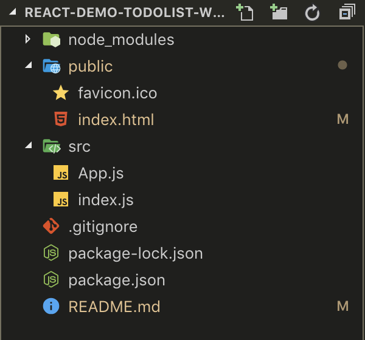
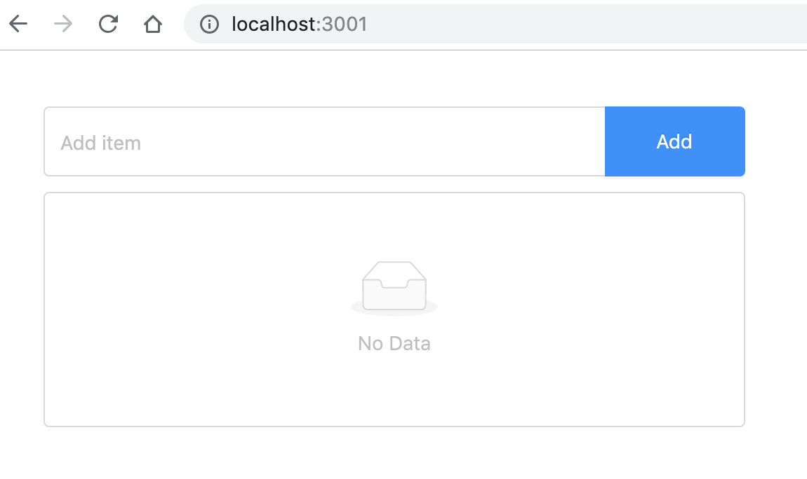
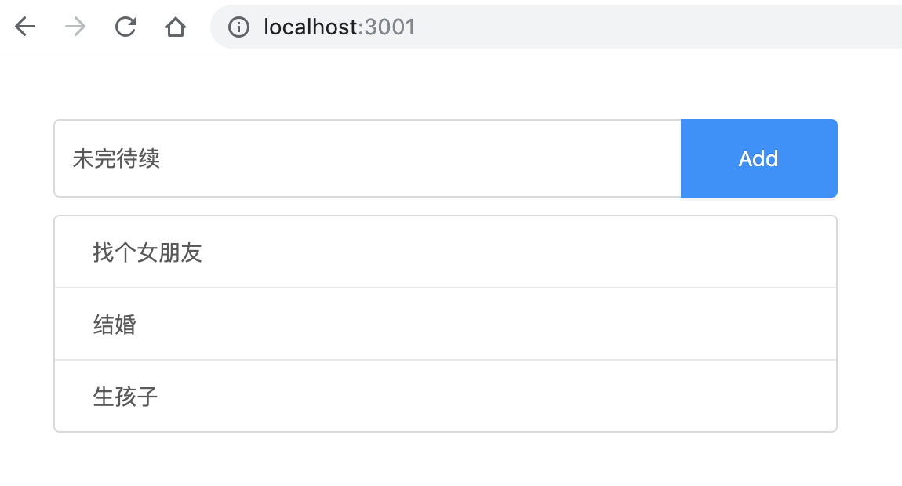
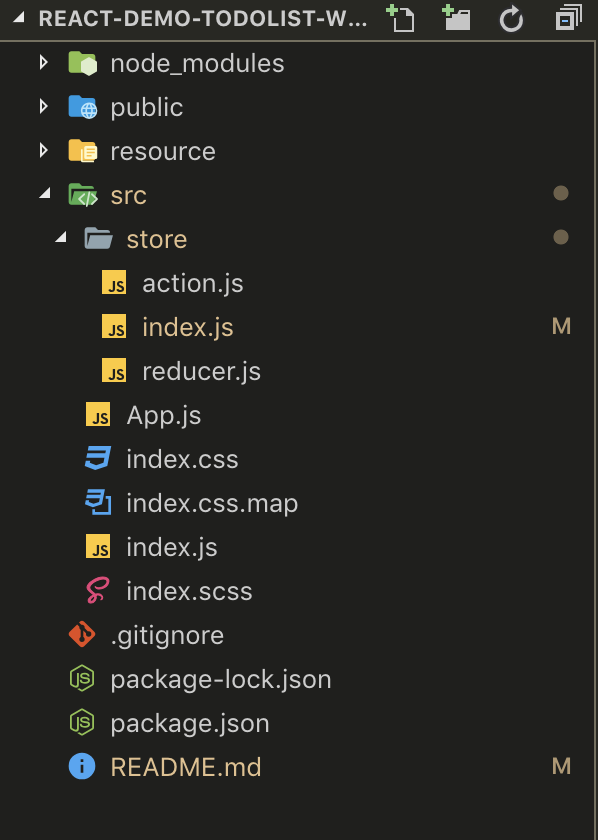

## React demo todo list with redux

> 这是一个用 **redux** 写成的简单的 react todo list demo, 并使用 Ant Design 优化界面。本文是自己对 **redux** 的理解和总结的开发流程，希望帮助其他初学者迅速理解 **redux**，并构建一个简单的项目。它并不是一个 **redux** 的教学。在此之前，可以阅读[官网文档](https://reactjs.org/tutorial/tutorial.html)，或者这本[React 小书](http://huziketang.mangojuice.top/books/react/), 熟悉 react 以及 **redux** 的工作原理和开发。这是我的上一个[todo list demo](https://github.com/stekovinbranturry/basic-react),它是使用最基础的 react 写的，不涉及 **redux** 等组件。

> 请注意**redux**和**react-redux**的区别，本项目并没有直接使用**react-redux**组件，只是用**redux**组件来帮助理解这种状态管理模式

> 如果有哪些错误或者漏洞，请在 issue 中提出

## 安装和运行

1. 在命令行中运行以下命令来安装项目所需要的依赖包
   > `npm install`
2. 运行项目，在浏览器中自动打开
   > `npm start`

## redux 开发流程

> 首先我们要梳理一下 redux 的开发流程，简单来说有以下三个步骤：

1. 创建 reducer 和 store 和需要的组件
2. 在组件中向 store 发送 action
3. 在 store 的 reducer 中接收并处理 action

## 项目解析

### 1. 使用`create-react-app`创建项目，并安装本项目所需的两个包`redux`和`antd`

> `create-react-app react-with-redux`

> `npm install redux antd --save`

### 2. 删除不必要的文件，精简项目结构，最终的结构为：



### 3. 在`./src/index.js`中`import`所需的 package, component, css

```js
import React from "react";
import ReactDOM from "react-dom";
import "./index.css";
import "antd/dist/antd.css";
import App from "./App";

ReactDOM.render(<App />, document.getElementById("root"));
```

- 在这里我创建了`index.scss`，并使用 VS Code 的**live sass compile**插件来自动生成`index.css`文件，当然，你也可以直接使用 CSS 或者 less 等 CSS 预处理工具

### 4. 使用[Ant Design](https://ant.design/docs/react/introduce-cn)在`./src/App.js`中迅速构建 UI

```js
import React, { Component, Fragment } from "react";
import { Input, Button, List } from "antd";

const data = [];

export default class App extends Component {
  render() {
    return (
      <Fragment>
        <div className="input_area">
          <Input placeholder="Add item" />
          <Button type="primary">Add</Button>
        </div>
        <div className="show_area">
          <List
            bordered
            dataSource={data}
            renderItem={item => <List.Item>{item}</List.Item>}
          />
        </div>
      </Fragment>
    );
  }
}
```

> 显示效果为：



### 5. 在`./src`下创建`store`文件夹，在里面创建 store 存放的`index.js`,reducer 存放的`reducer.js`

- 在`reducer.js`中写入以下代码，给参数`state`一个初始化的对象

```js
const defaultState = {
  value: "", // 存放输入框的值
  list: [] // 存放todo item的数组
};

export default (state = defaultState, action) => {
  return state;
};
```

- 在`index.js`中使用刚刚创建的`reducer`来创建并`export` `store`

```js
import { createStore } from "redux"; // 从组件redux中引入createStore方法
import reducer from "./reducer"; // 引入reducer

const store = createStore(reducer);

export default store;
```

### 6. 在`App.js`中引入`store`

- 通过`store.getState`方法获取`store`中的属性，并让`this.state`接收。在这个项目里，只有两个简单的属性`value`和`list`。并通过`store.subscribe`来让`this.state`响应`store`中属性的变化。可以理解为把`store`绑定到`state`
- 对于`this.handle*`方法，建议统一在`constructor`中`bind this`，可以一定程度上优化性能，并容易阅读 code

```js
constructor(props) {
  super(props);
  this.state = store.getState();
  this.handleStoreChange = this.handleStoreChange.bind(this);
  store.subscribe(this.handleStoreChange);
}

handleStoreChange() {
  this.setState(store.getState());
}
```

### 7. 定义 action,用 dispatch 向 store 发送 action

- 在这个项目中，有三种行为，需要去定义三个`action`
  - 输入框 value 的变化： **CHANGE_VALUE**;
  - 点击添加按钮提交输入的 value, 添加 todo **item：ADD_ITEM**;
  - 点击 todo item 删除： **DELETE_ITEM**;
- 对于`action.type`, 建议使用完全大写和下划线的命名方式

- 我们拿第一个 action：**CHANGE_VALUE** 举例

```js
<Input
  placeholder="Add item"
  // 为input框添加onChange事件监听value变化，对应action1 CHANGE_VALUE
  onChange={this.handleValueChange}
  // 将输入的value显示在input框里
  value={this.state.value}
/>
```

- 在`handleValueChange`方法中定义一个`action`，里面包含两个属性，`type`指的是你要让`store`去做什么，其他的属性是让`store`接收然后利用这些属性做出动作。最后用`dispatch`把命令传送给`store`

```js
handleInputChange(e) {
  const action = {
    type: 'CHANGE_VALUE',
    value: e.target.value
  };
  store.dispatch(action);
}
```

### 8. 在 `reducer` 中创建接收 `action` 后的行为

- 下面是`reducer的结构`

```js
const defaultState = {
  value: "",
  list: []
};
// 用结构赋值定义action变量，这样让代码更加清晰，事先定义变量永远是个好习惯
const [CHANGE_VALUE, ADD_ITEM, DELETE_ITEM] = [
  "CHANGE_VALUE",
  "ADD_ITEM",
  "DELETE_ITEM"
];

// 分别为三个action创建接收的方法
const changeValue = (state, action) => {};

const addItem = (state, action) => {};

const deleteItem = (state, action) => {};

// 用swicth判断action type
export default (state = defaultState, action) => {
  switch (action.type) {
    case CHANGE_VALUE:
      return changeValue(state, action);
    case ADD_ITEM:
      return addItem(state, action);
    case DELETE_ITEM:
      return deleteItem(state, action);
    default:
      return state;
  }
};
```

- 还是拿`CHANGE_VALUE`做例子, 这个方法接收从组建中传来的两个参数，`state`相当于之前的状态。我们不能直接更改 state，因此定义一个`newState`，先拷贝原来的 state，然后把 action 中的 value 赋值给它，并返回这个新的状态

```js
const changeValue = (state, action) => {
  const newState = { ...state };
  newState.value = action.value;
  return newState;
};
```

- 接下来仿照这个思路完成其他两个 action，这样这个简单的 redux 项目就做好了

### 9. 优化代码

#### 9.1 分离 action

- 在之前的 code 中，我们分别在`App.js`和`reducer.js`中定义和使用了`action`，这样不仅不利于管理，也容易在引用的时候出错，我们可以把`action`给剥离出来

- 在`src/store`文件夹下面创建一个`action.js`, 定义并 export 出我们定义的三种 action type。第七步中创建的`handle*`函数中定义的 action，也优化一下，让它通过函数去创建，`action.js`代码如下

```js
// action types
export const [CHANGE_VALUE, ADD_ITEM, DELETE_ITEM] = [
  "CHANGE_VALUE",
  "ADD_ITEM",
  "DELETE_ITEM"
];

// action creators
export const createChangeValue = value => ({ type: CHANGE_VALUE, value });

export const createAddValue = () => ({ type: ADD_ITEM });

export const createDeleteValue = index => ({ type: DELETE_ITEM, index });
```

- 然后在`App.js`,`reducer.js`中`import`这些 action 并替换原来的代码

#### 9.2 用箭头函数取代`bind`

- 我们在`App.js`中使用了太多的 bind，如果有更多的`handle*`函数，每次都需要去 bind 那就太坑爹了，这里也可以使用箭头函数去代替，这样就不需要 bind 了，因为箭头函数不绑定`this`, 可以看这个文档去具体了解
  [箭头函数](https://developer.mozilla.org/zh-CN/docs/Web/JavaScript/Reference/Functions/Arrow_functions)

```js
// 这是原来的
handleStoreChange () {
  this.setState(store.getState());
};
// 这是使用箭头函数的
handleStoreChange = () => {
  this.setState(store.getState());
};
```

### 10. 最终的项目结构和 UI 如下：



